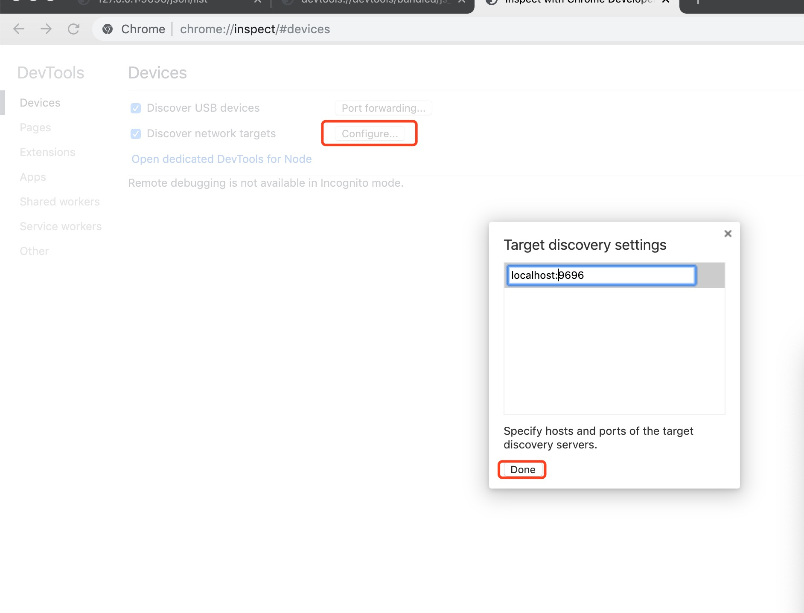
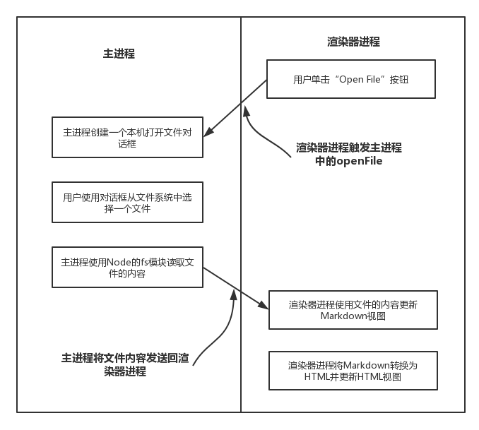
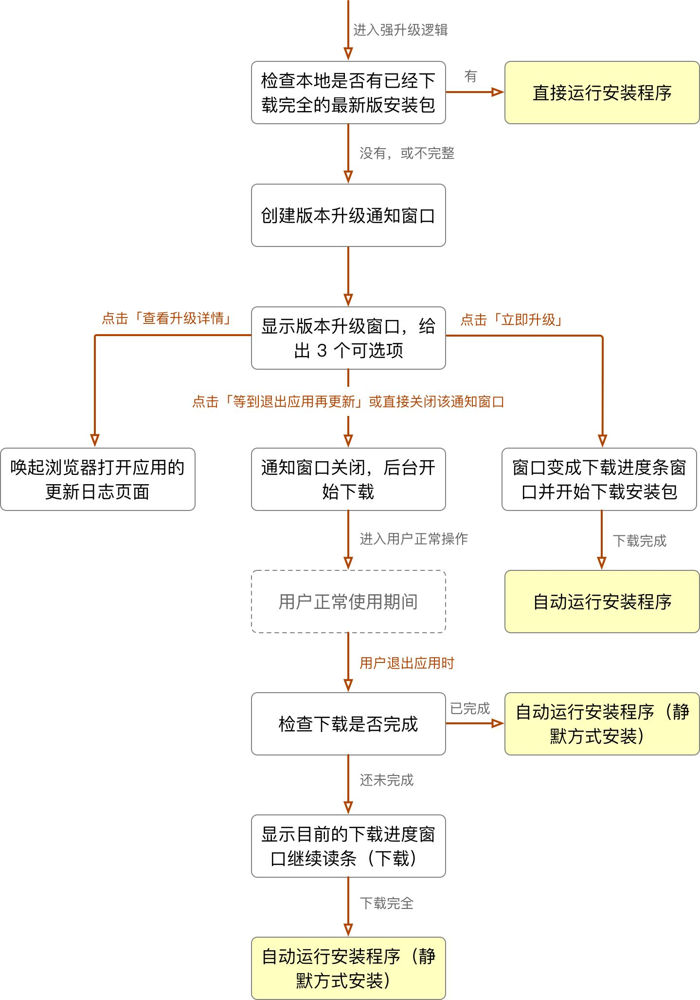

# electron

<div align="center">
  
</div>

[Electron](https://electronjs.org/) 是由 Github 开发,使用 JavaScript, HTML 和 CSS 构建跨平台的桌面应用,原理是 electron 通过将 chromium 和 node.js 合并到同一个运行时环境中，并将其打包为 Mac，Windows 和 Linux 系统下的应用来实现这一目的。

## 开始

```shall
# 克隆示例项目的仓库
$ git clone https://github.com/electron/electron-quick-start

# 进入这个仓库
$ cd electron-quick-start

# 安装依赖并运行
$ npm install && npm start
```

每次修改 mian.js 文件都需要自动重启，安装 nodemoon

```shall
npm install nodemoon --save-dev
```

在 package.json 中配置，然后启动"npm install start"

```json
    "start": "nodemoon --watch main.js --exec 'electrion .'",
```

## 调试

### 主进程调试

在启动 electron 中配置 "--inspect",启动 “npm start”


在 chrome 中打开“chrome://inspect/#devices” 配置



<!--  -->


#### 渲染进程

在 main.js 打开控制台“mainWindow.webContents.openDevTools()”


渲染进程与主进程的通信调试，安装“devtron”


## 进程



### 主进程- Main Process

1.  可以使用和系统对接的 Electron API-创建菜单,上传文件等
2.  创建渲染进程- Renderer Process
3.  全面支持 Node.js
4.  一个程序只有一个主进程，作为整个程序的入口点

### 渲染进程- Renderer Process

1.  可以有多个,每个对应一个窗口
2.  每个都是一个单独的进程
3.  全面支持 Node.js 和 DOM API
4.  可以使用一部分 Electron 提供的 API

### 主进程(ipcMain)与渲染进程通信(ipcRenderer)

```javascript
//主进程
ipcMain.on('open-data', (event, data) => {
  console.log(data);
  event.sender.send('send-file');
});

//渲染进程
//发送消息
ipcRenderer.send('open-data');
//监听消息
ipcRenderer.on('send-file', (event, data) => {
  console.log(data);
});
```

## 常用模块

### electron-store:本地持久化

```javascript
const Store = require('electron-store');
const store = new Store();

store.set('unicorn', '🐎');
console.log(store.get('unicorn')); //🐎

store.set('foo.bar', true);
console.log(store.get('foo')); //=> {bar: true}

store.delete('unicorn');
console.log(store.get('unicorn')); //=> undefined
```

### electron-is-dev 检查当前(生产 开发)环境

```javascript
const isDev = require('electron-is-dev');

if (isDev) {
  console.log('Running in development');
} else {
  console.log('Running in production');
}
```

### electron-log 日志

```javascript
const log = require('electron-log');

log.info('Hello, log');
log.warn('Some problem appears');
electron-log支持的日志级别有：error, warn, info, verbose, debug, silly
```

### electron-builder 打包

```json
"build": {
    "productName":"xxxx",//项目名 这也是生成的exe文件的前缀名
    "appId": "com.xxx.xxxxx",//包名
    "copyright":"xxxx",//版权  信息
     "compression": "store", // "store" | "normal"| "maximum" 打包压缩情况(store 相对较快)，store 39749kb, maximum 39186kb
    "directories": { // 输出文件夹
      "output": "build"
    },
    "publish": [
      {
        "provider": "generic",
        "url": "http://127.0.0.1:3000/xxx/"
      }
    ],
    "extraResources":  { // 拷贝dll等静态文件到指定位置
        "from": "./app-update.yml",
        "to": "./b.txt"
    },
    "publish": [
        {
          "provider": "generic", // 服务器提供商 也可以是GitHub等等
          "url": "http://xxxxx/" // 服务器地址
        }
      ],
     "asar": true,//asar打包
    "files": [
      "**/*",
      "!docs${/*}",
      "!node_modules/@paulcbetts/cld/deps/cld${/*}"
    ],
    "mac": {
      "category": "public.app-category.productivity",
      "artifactName": "${productName}-${version}-${arch}.${ext}"
    },
    "linux": {
      "category": "Chat;GNOME;GTK;Network;InstantMessaging",
      "packageCategory": "GNOME;GTK;Network;InstantMessaging",
      "description": "etrial Desktop Client for Linux",
      "target": [
        "deb",
        "zip",
        "AppImage",
        "snap"
      ],
      "maintainer": "Akash Nimare <akash@etrial.com>",
      "artifactName": "${productName}-${version}-${arch}.${ext}"
    },
    "deb": {
      "synopsis": "etrial Desktop App",
      "afterInstall": "./scripts/debian-add-repo.sh",
      "afterRemove": "./scripts/debian-uninstaller.sh"
    },
    "snap": {
      "synopsis": "etrial Desktop App"
    },
    "dmg": {
      "background": "hardware/build/appdmg.png",
      "icon": "hardware/build/icon.icns", //路径
      "iconSize": 100,
      "contents": [
        {
          "x": 380,
          "y": 280,
          "type": "link",
          "path": "/Applications"
        },
        {
          "x": 110,
          "y": 280,
          "type": "file"
        }
      ],
      "window": {
        "width": 500,
        "height": 500
      }
    },
    "win": {
      "target": [
        {
          "target": "nsis-web",  //我们要的目标安装包
          "arch": [//// 这个意思是打出来32 bit + 64 bit的包，但是要注意：这样打包出来的安装包体积比较大，所以建议直接打32的安装包
            "x64",
            "ia32"
          ]
        }
      ],
      "icon": "hardware/build/icon.ico", //图标路径
      "artifactName": "${productName}-Web-Setup-${version}.${ext}",
      "publisherName": "taimei Labs, Inc."
    },
    "nsis": {
      "perMachine": false,//是否开启安装时权限限制（此电脑或当前用户）
      "oneClick": false, // 是否一键安装
      "allowElevation": true, // 允许请求提升。 如果为false，则用户必须使用提升的权限重新启动安装程序。
      "allowToChangeInstallationDirectory": true, // 允许修改安装目录
     "installerIcon": "./build/icons/aaa.ico",// 安装图标
    "uninstallerIcon": "./build/icons/bbb.ico",//卸载图标
    "installerHeaderIcon": "./build/icons/aaa.ico", // 安装时头部图标
    "createDesktopShortcut": true, // 创建桌面图标
    "createStartMenuShortcut": true,// 创建开始菜单图标
    "shortcutName": "xxxx", // 图标名称
    "include": "build/script/installer.nsh", // 包含的自定义nsis脚本 这个对于构建需求严格得安装过程相当有用。
    "script" : "build/script/installer.nsh", // NSIS脚本的路径，用于自定义安装程序。 默认为build / installer.nsi
    }
  }
```

### electron-updater （--save）自动更新检测



```javascript
//检测是否更新
autoUpdater.on('checking-for-update', () => {
  sendStatusToWindow('正在检测是否需要更新...');
});

//检测到新版本
autoUpdater.on('update-available', () => {
  console.log('update-available');
});

//当前已是最新版本
autoUpdater.on('update-not-available', () => {
  console.log('update-not-available');
});

//下载出错
autoUpdater.on('error', err => {
  sendStatusToWindow('error. ' + err);
});

//下载进度
autoUpdater.on('download-progress', data => {
  console.log('download-progress');
});

//下载完毕
autoUpdater.on('update-downloaded', () => {
  console.log('update-downloaded');
});
```
