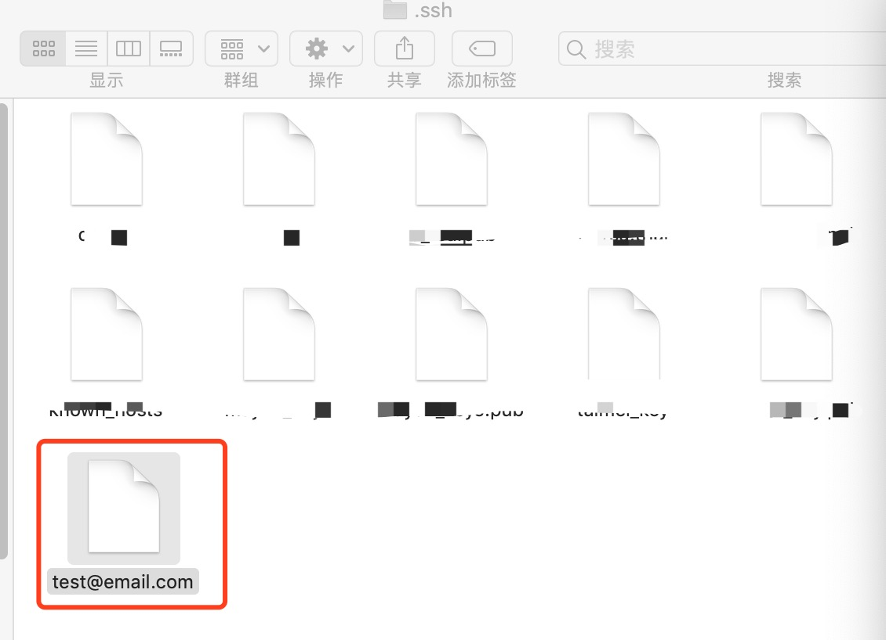

# ssh

## 本机

第一步打开本地命令行，输入" ssh-keygen -t rsa -C 'test' -f 'test@email.com' " 一路回车生成密钥文件

找到当前用户下的 ”.ssh“ 隐藏文件

然后把 ”test@email.com“ 拷贝到 “.ssh”文件夹下

用 vim 打开 .ssh 文件夹下的 config 文件（如果没有文件就新建)

输入以下的信息 Host: 是你的远程服务器地址， IdentityFile ：是你的私钥文件地址

## scp 拷贝

使用”scp“ 把公钥拷贝到你指定的服务器上根目录下的“.ssh” 文件 至此本地配置结束 ✌️

## 远程服务器

第一次登录远程服务器 输入‘yes’，然后在输入密码即可

登录成功

找到根目录下的".ssh" 文件

把 公钥 使用“ >> ”追加到 “authorized_keys” 文件里（如果没有文件就新建)

## 成功

尝试 "ssh root@112.74.18.XXX" 发现不用输入密码㊙ ️ 就可以直接登录到远程服务器上，到此配置成功 ✌️

